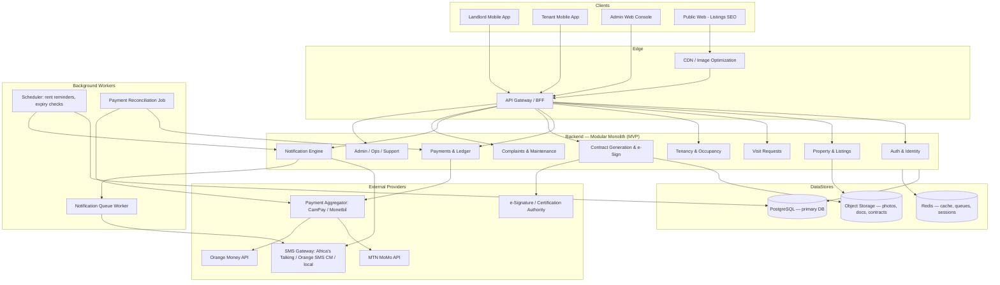
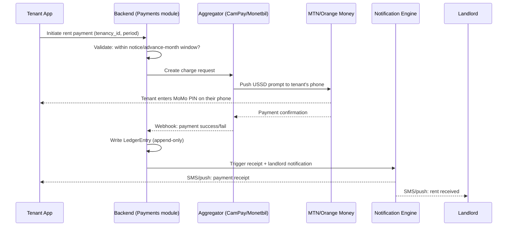

# Rental Platform — System Architecture & MVP Definition
### Cameroon-first, Africa-ready

---

## 0. Design principles (drawn from the market research)

These aren't arbitrary preferences — each one traces back to a specific fact about the Cameroonian market:

| Principle | Why |
|---|---|
| **Backend does the heavy lifting; clients stay thin** | Internet penetration is ~42%, mobile broadband ~30/100 people — well below the African average of 52/100. Assume patchy 3G, not steady 4G/LTE. |
| **SMS is a first-class notification channel, not a fallback** | 96% mobile connection penetration vs. 42% internet penetration. Anything mission-critical (rent due, visit confirmed, termination notice) must reach someone even if they never open the app that week. |
| **Mobile money is the payment backbone, cards are secondary** | 12M+ mobile money users in Cameroon; MTN MoMo and Orange Money dominate. Card rails are a nice-to-have for a minority (diaspora, expats). |
| **Bilingual by construction (FR/EN), not by translation layer bolted on later** | Cameroon's legal and administrative split (Francophone civil law regions vs. Anglophone common-law regions) means contracts, notices, and UI text need to be correct in both, not just present in both. |
| **The system never claims to *legally* evict anyone** | Eviction requires statutory notice (commonly 3 months for ordinary leases, up to 6 months where OHADA AUDCG commercial-lease rules apply) and, on dispute, a court process. The platform automates *notice and payment-cutoff*, not legal termination. |
| **Financial data integrity > feature velocity** | Rent ledgers are the thing landlords will actually sue over or refer to in court disputes (case law consistently turns on whether accurate payment records exist). Build this as an append-only, auditable ledger from day one, not a mutable "amount_paid" field. |
| **Design for provider downtime** | MTN MoMo / Orange Money outages, and SMS gateway hiccups, will read to your users as "the app is broken." Every payment and notification flow needs a queued-retry and manual-reconciliation path. |

---

## 1. High-level architecture



**Why a modular monolith and not microservices for the MVP:** you're launching with a handful of landlords. Microservices buy you independent scaling and deployment at the cost of operational complexity (service discovery, distributed tracing, network failure handling) — complexity you don't need yet and that will slow you down. Structure the monolith into clearly bounded modules (as above) with **no direct cross-module database access** — only through internal service interfaces. This gives you a clean extraction path into microservices later (e.g., Payments is usually the first thing worth splitting out once transaction volume grows) without a rewrite.

---

## 2. Mobile / client layer

### 2.1 One app, two roles — not two apps
A single cross-platform app (landlord and tenant both log into the same app, UI adapts by role) is the right call here, not separate landlord/tenant apps. Reasons: many people will be *both* over time (a landlord who also rents elsewhere), it halves your build/maintenance cost, and it avoids the "which app do I download" confusion for a first-time digital-platform user.

- **Framework:** React Native or Flutter — both fine; pick based on your team's existing skill, not the tech itself. Flutter tends to render more consistently on the lower-end Android devices common in this market (Cameroon is a heavily Android market, consistent with African smartphone patterns generally); React Native has a larger hiring pool if you're recruiting locally in Douala/Yaoundé.
- **Progressive Web App (PWA) as a companion, not a replacement:** given data costs and the 42% internet-penetration ceiling, a lightweight PWA for landlords to check dashboards from a browser (no app-store download, smaller payload) is worth having alongside the native app, especially for landlord onboarding where you're personally walking them through it.
- **Offline-first data layer:** local SQLite/WatermelonDB cache with background sync. A landlord should be able to open the app with no signal and still see their occupancy list and last-known payment status; writes (e.g., approving a visit request) queue and sync when connectivity returns.
- **Image handling:** client-side compression before upload (target <300KB per listing photo), lazy-loaded image grids, and WebP where supported — non-negotiable given the bandwidth constraints documented above.
- **Every critical action has an SMS shadow.** Push notifications assume a live data connection and a signed-in app session; SMS does not. Rent-due reminders, visit-request confirmations, and termination notices go out over SMS regardless of push notification status.

### 2.2 Admin web console (internal + landlord "power user" view)
A separate responsive web app (not mobile-optimized-only) for:
- Your internal ops/support team (verifying landlord ID/ownership docs, resolving payment disputes, moderating listings).
- Landlords with multiple properties who want spreadsheet-like views (occupancy grid, payment history export) — this is a real, distinct use case from the "quick check on my phone" mobile flow.

---

## 3. Backend architecture

### 3.1 Suggested stack
| Layer | Recommendation | Rationale |
|---|---|---|
| Language/framework | Node.js (NestJS) or Python (Django) | Both have mature ecosystems, good async support for payment webhooks, and large African dev talent pools (Django especially popular in Francophone Africa training programs). Pick based on team hiring reality in Cameroon, not personal preference. |
| Primary DB | PostgreSQL | Strong transactional integrity (critical for the payment ledger), native JSONB for semi-structured fields (e.g., contract metadata), mature and well-understood by local hires. |
| Cache / queues | Redis | Session storage, rate limiting, and as the backing store for a job queue (BullMQ if Node, Celery+Redis if Python). |
| Object storage | S3-compatible (AWS S3 or a cheaper regional equivalent) | Property photos, uploaded ID/ownership documents, generated contract PDFs. |
| API style | REST (OpenAPI-documented) | Simpler for a small team, easier for future third-party integrations (e.g., if you later expose an API to real-estate agencies) than GraphQL's added complexity. |

### 3.2 Core modules and their responsibilities

**Auth & Identity**
- Phone-number-based auth (OTP via SMS) as primary — email/password is secondary for admin users. This matches how Cameroonians already authenticate for mobile money.
- Role model: `landlord`, `tenant`, `admin`, `support_agent`. A single user account can hold both `landlord` and `tenant` roles simultaneously.
- KYC tier system: `unverified` → `id_verified` (national ID uploaded and checked) → `ownership_verified` (landlord has submitted title/land certificate reference, reviewed by an admin). Gate high-trust actions (publishing a listing, generating a contract) behind the appropriate tier.

**Property & Listings**
- Property → Unit hierarchy (a landlord's "property" can contain multiple rentable units — important for apartment blocks/compounds, common in Douala/Yaoundé).
- Status machine per unit: `vacant` → `visit_requested` → `reserved` → `occupied` → `notice_given` → `vacant`.
- Geo-tagged photo capture at listing creation time (metadata stored, not just the image) — a direct countermeasure to the fake-listing fraud problem identified in the market research.

**Visit Requests**
- Tenant requests a visit → landlord notified (push + SMS) → landlord accepts/proposes alternate time/declines → both parties get a calendar-style confirmation.
- Auto-expire unanswered requests after a configurable window (e.g., 48h) to keep the funnel honest and signal responsiveness to prospective tenants.

**Tenancy & Occupancy**
- The `Tenancy` entity is the spine of the system: links a `Unit`, a `Tenant`, a `Landlord`, agreed rent amount, currency (XAF), billing cycle, start date, and — critically — a `notice_period_days` field that **defaults to the statutory minimum** (e.g., 90 days for an ordinary lease) and cannot be set below it by the landlord through the UI.
- `TerminationNotice` as its own entity (not a mutation of `Tenancy`): records who issued it, the date issued, the effective date, the notice document generated, and delivery confirmation (SMS/app receipt). This is what protects both the landlord (proof of proper notice, echoing the case law where a landlord's eviction claim was thrown out for lack of proof) and the tenant (proof they were given legally adequate warning).
- Occupancy dashboard for landlords: which unit, which tenant, contract dates, current payment status — exactly as specified in your original requirements.

**Payments & Ledger** — see Section 4, it's detailed separately given its importance.

**Contract Generation & e-Signature**
- Template engine (e.g., merge tenancy data into a bilingual FR/EN contract template) producing a PDF.
- e-Signature integration: under Cameroonian law, an *advanced* electronic signature carries equal legal weight to a handwritten one provided it meets specific technical conditions and is generated via a reliable, certified device/process. For the MVP, a straightforward "click to sign with OTP-verified identity + audit trail" (timestamp, IP, device fingerprint) is likely sufficient for a basic e-signature; if you want the stronger "advanced" tier, that means integrating with a certification authority recognized under Cameroon's cybersecurity law framework — **this needs a direct conversation with a Cameroonian lawyer before you decide which tier to build**, since I don't have a definitive answer on which named CAs are currently active/recommended in-market.
- Same generation pipeline produces the `TerminationNotice` document referenced above.

**Notification Engine**
- Unified interface (`notify(user, event_type, channel_priority=[push, sms])`) so every module just fires an event and the engine decides channel/timing/retry, rather than each module hand-rolling SMS calls.
- Scheduled jobs: rent-expiry reminders (2 weeks / 1 month before, per your spec, configurable per landlord), overdue-rent escalation, termination-notice delivery confirmation chase.

**Complaints & Maintenance**
- Tenant-submitted complaint → categorized (plumbing/electrical/security/other) → photo/video attachment → routed to landlord → status tracked (`open` / `acknowledged` / `in_progress` / `resolved`).
- Landlord-facing aggregate view: complaints grouped by unit/property, so patterns (e.g., "unit 4B has had 3 plumbing complaints this year") are visible — this is genuinely useful data for landlords managing multiple units, beyond just the individual ticket.

**Admin / Ops**
- Landlord/property verification queue (manual review of ID + ownership documents).
- Payment dispute resolution tools (view full ledger + provider transaction reference).
- Listing moderation (flagged/reported listings).

### 3.3 Data model — core entities (simplified)

```
User (id, phone, roles[], kyc_tier, locale)
Property (id, landlord_id, address, geo_location, ownership_doc_ref, verified_at)
Unit (id, property_id, bedrooms, rent_amount, currency, status, photos[])
VisitRequest (id, unit_id, tenant_id, requested_at, status, confirmed_slot)
Tenancy (id, unit_id, tenant_id, landlord_id, start_date, rent_amount,
         billing_cycle, notice_period_days, max_advance_months, status)
TerminationNotice (id, tenancy_id, issued_by, issued_at, effective_date,
                    document_url, delivery_confirmed_at)
Contract (id, tenancy_id, document_url, signed_by_landlord_at, signed_by_tenant_at,
          signature_audit_trail)
Payment (id, tenancy_id, amount, currency, provider, provider_txn_ref,
         status, initiated_at, confirmed_at, period_covered)
LedgerEntry (id, tenancy_id, payment_id, type[debit/credit], amount, balance_after, created_at)  -- append-only
Complaint (id, tenancy_id, category, description, media[], status, created_at)
```

The `LedgerEntry` table being **append-only** (never UPDATE, never DELETE — corrections happen via a new offsetting entry) is the single most important data-integrity decision in this schema, given how much the case law hinges on accurate, provable payment records.

---

## 4. Payments architecture (detailed)

### 4.1 Provider strategy for MVP
Use an **aggregator**, not direct MTN/Orange integration, for launch:
- **CamPay** or **Monetbil** — both are Cameroon-specific aggregators that already handle MTN Mobile Money and Orange Money integration, sandbox testing, and the OTP/USSD confirmation flow on the provider side. This eliminates a huge amount of integration work (separate sandbox onboarding, key management, and compliance overhead with two separate telecom-operator API programs) that isn't worth taking on before you've validated the product with your initial landlord cohort.
- Direct MTN MoMo / Orange Money integration becomes worth the effort once transaction volume justifies negotiating better aggregator rates or you need functionality the aggregator doesn't expose.

### 4.2 Payment flow



Key design points:
- **The `Validate` step before even contacting the aggregator is what enforces your rule** — "tenant cannot pay past the termination date or beyond the landlord's max-advance-months setting." This is pure backend business logic, not something the payment provider needs to know about — reject the request before money moves.
- **Webhooks are not trusted blindly.** Verify the aggregator's webhook signature, and independently poll the transaction-status endpoint if a webhook doesn't arrive within an expected window (mobile money networks do have delivery delays/failures). This is what the `RECON` background job in the architecture diagram is for — it periodically reconciles "pending" payments against the provider's own transaction records, so a dropped webhook never silently leaves a tenant thinking they've paid when the ledger disagrees.
- **Idempotency keys** on every payment initiation request, since retries (from flaky connections) are the norm here, not the exception — you do not want a double-charge because a tenant tapped "Pay" twice on a slow connection.
- **Receipts are generated server-side as immutable records** (PDF or structured data) tied to the specific `LedgerEntry`, not recomputed on demand — this is your evidentiary trail if a payment dispute ever reaches the level of the eviction case law discussed earlier, where the party with the paper trail wins.

### 4.3 What the platform should *not* try to do at MVP stage
- **Do not hold funds in an actual escrow/wallet model** unless you've confirmed the licensing implications with a Cameroonian financial regulator — operating something that functions like a payment institution/e-money issuer typically requires separate licensing from BEAC/COBAC (the regional central bank and banking commission) in the CEMAC zone. At MVP, structure payments as **direct pass-through** (tenant pays, funds settle to landlord's own mobile money account, platform takes its fee via a separate mechanism — e.g., invoicing the landlord monthly, or a small top-up fee charged to the tenant) rather than the platform itself holding tenant funds. This is a point to confirm directly with a lawyer/compliance advisor familiar with CEMAC payment regulation — I don't have a definitive answer on the exact licensing threshold and am flagging it rather than guessing.

---

## 5. Notification infrastructure

- **SMS gateway options confirmed to serve Cameroon:** Africa's Talking (pan-African, explicitly lists Cameroon among supported markets), Orange's own SMS Cameroon API (Orange-network-only, useful given Orange's market share), and local providers such as Web2Sms237. For MVP, a pan-African aggregator (Africa's Talking) is the simpler single integration; add Orange's native API later if delivery rates to Orange numbers need improving.
- **Delivery-tiered notification logic:** critical, time-bound messages (rent due today, visit confirmed, termination notice) go out via SMS immediately regardless of push status; lower-urgency messages (new listing matching saved search) can be push-only to control SMS cost.
- **Bilingual templates** stored per event type, selected by the recipient's stored `locale`.

---

## 6. Infrastructure & hosting

- **No AWS (or major cloud) region exists inside Central Africa.** The nearest AWS region is Cape Town (af-south-1, opened 2020, three Availability Zones) — meaningfully far from Cameroon geographically. I don't have a verified Cameroon-to-Cape-Town or Cameroon-to-Europe latency figure to cite, so don't take my word on exact milliseconds; what's safe to say is that **your backend's physical location will add real round-trip latency for every request**, which is precisely why the offline-first client design (Section 2.1) matters as much as server choice.
- **Practical options, roughly in order of likely fit for an early-stage team:**
  1. **AWS af-south-1 (Cape Town)** — most mature tooling/ecosystem, in-continent, but billed in USD only and historically has had friction with some African-issued cards on new accounts.
  2. **A European region (e.g., AWS eu-west-3 Paris, or OVHcloud which has strong Francophone-market presence and datacenters in France)** — worth comparing against Cape Town empirically (run your own latency test from Douala/Yaoundé to each candidate region) rather than assuming either is faster; I don't have verified numbers for this specific corridor.
  3. **Local/regional providers** — worth a scan of whether any CEMAC-based hosting/colocation providers exist with adequate reliability; I did not find strong evidence of a mature local cloud IaaS option during this research, so I'd treat "host locally" as unproven until you validate it directly.
- **CDN in front of listing photos and static assets regardless of backend region** — this does the most to offset distance-related latency for the parts of the experience (images) that dominate perceived load time on a slow connection.
- **Start on a single region, single well-monitored environment.** Multi-region active-active is not an MVP concern.

---

## 7. Security & compliance checklist

- **Personal Data Protection Law (No. 2024/017)** is in force with mandatory breach-notification duties, and its compliance deadline (June 2026) has already passed as of today — build consent capture, data minimization, and a breach-notification runbook in from day one, not as a retrofit.
- **ANTIC** is the relevant regulator for electronic communications/certification matters — worth registering the relationship early if your e-signature implementation needs certification-authority recognition.
- Encrypt ID documents and ownership documents at rest (S3 server-side encryption at minimum); restrict access to the admin verification role only.
- Rate-limit and monitor the OTP/auth endpoints — SMS OTP flows are a common abuse target (toll fraud via triggering excessive SMS sends).
- Webhook endpoints (payment callbacks) must verify provider signatures — never trust an unauthenticated POST as "payment confirmed."

---

## 8. MVP definition

### 8.1 Goal of the MVP
Prove, with your existing interested landlords, that: (1) landlords will actually list and manage units through the platform instead of WhatsApp/paper, and (2) tenants will actually pay rent through it via mobile money instead of cash/hand-to-hand. Everything else is secondary until those two behaviors are validated.

### 8.2 In scope for MVP

| Feature | Notes |
|---|---|
| Landlord & tenant accounts (phone + OTP) | Core auth only — no email login needed yet |
| Property/unit listing with photos | Geo-tagged photo capture included from day one (fraud countermeasure, cheap to build now vs. retrofit) |
| Visit request flow | Request → landlord notified → accept/decline/reschedule |
| Occupancy dashboard | Which unit, which tenant, contract dates, current balance |
| Rent payment via mobile money (aggregator) | MTN MoMo + Orange Money via CamPay or Monetbil |
| Append-only payment ledger + auto-generated receipts | This is your legal/trust backbone — do not cut this corner |
| Rent-expiry reminders (2 weeks / 1 month default) | Via SMS + push |
| Basic bilingual (FR/EN) tenancy contract generation + simple e-signature | Basic-tier e-signature (OTP-verified + audit trail); confirm with legal counsel whether advanced-tier is needed before launch |
| Termination notice workflow | Enforces statutory minimum notice period as a floor; generates formal notice document; blocks rent payment past effective date / beyond landlord's max-advance-months setting |
| Complaints submission + landlord view | Category + photo, status tracking |
| Admin console | Landlord/property verification, payment dispute lookup |

### 8.3 Explicitly out of scope for MVP (fast-follow candidates)
- Public SEO-optimized listings site for organic discovery (start with direct landlord-to-tenant relationships you're personally facilitating; open discovery is a growth-stage feature, not a trust-building one).
- In-app messaging/chat (SMS + visit-request flow covers the essential communication for now).
- Tenant credit-scoring or rent-financing products (the Nigerian precedent — Spleet, Kwaba — shows this is a strong later-stage feature, not a launch one).
- Multi-currency/international payments.
- Automated maintenance-vendor marketplace (complaints tracking, yes; dispatching contractors, not yet).
- USSD fallback channel — valuable given the connectivity data, but build it once you've observed real usage patterns from your pilot cohort rather than guessing at the flows upfront.
- Direct (non-aggregator) MTN/Orange API integration.

### 8.4 Suggested build sequencing
1. Auth + Property/Unit + Listings (get landlords onboarding real units immediately — this alone replaces their WhatsApp/paper listing habit and starts generating trust).
2. Visit requests + occupancy dashboard (closes the loop on "who's in my property").
3. Payments (ledger + aggregator integration) — the highest-risk, highest-value piece; budget the most engineering time and QA cycles here given the reconciliation/idempotency requirements in Section 4.
4. Contract generation + e-signature.
5. Rent reminders + termination-notice workflow.
6. Complaints module + admin console polish.

### 8.5 Success metrics for the MVP phase
Since you're starting with a known, small set of landlords, track concrete behavioral signals rather than vanity metrics:
- % of that landlord cohort's units actually listed on the platform (vs. still managed off-platform).
- % of rent payments in a given month that go through the platform vs. reported as paid "outside" it.
- Time from visit request to landlord response (proxy for whether landlords are actually engaging, not just onboarded).
- Payment failure/retry rate (signal on aggregator reliability in practice, not just in sandbox).
- Number of support/manual-intervention cases needed per transaction (tells you how far from "self-serve" the flow really is yet).

---

## 9. Open items to resolve with local expertise before/at launch

I want to be explicit about where this document reflects solid research versus where a Cameroon-based professional needs to close the gap:

1. **Lawyer review of the termination/notice workflow** — confirm exact statutory notice periods applicable to your specific lease types and regions (Anglophone vs. Francophone), and whether AUDCG commercial-lease provisions could apply to any of your landlords' arrangements.
2. **E-signature tier decision** — basic OTP-audit-trail vs. advanced/certified signature, and if advanced, which certification authority to integrate with.
3. **Payment licensing check** — confirm with a CEMAC/BEAC-aware advisor that a pass-through (non-custodial) payment model avoids e-money-institution licensing requirements; do not assume this without confirmation.
4. **Real latency testing** from Douala/Yaoundé to candidate hosting regions (Cape Town vs. Europe) before committing infrastructure spend.
5. **Direct landlord pricing conversation** — since you already have interested landlords, ask them directly what commission/fee structure they'd accept before finalizing the monetization model.
